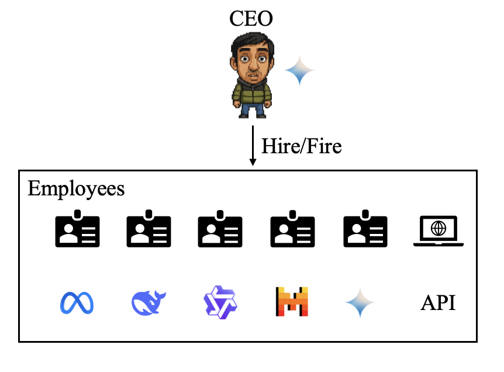

# HASHIRU: Hierarchical Agent System for Hybrid Intelligent Resource Utilization 
(For AgentX competition)



## Overview
HASHIRU is an agent-based framework designed to dynamically allocate and manage large language models (LLMs) and external APIs through a CEO model. The CEO model acts as a central manager, capable of hiring, firing, and directing multiple specialized agents (employees) over a given budget. It can also create and utilize external APIs as needed, making it highly flexible and scalable.

## Features
- **Cost-Benefit Matrix**:  
  Selects the best LLM model (LLaMA, Mixtral, Gemini, DeepSeek, etc.) for any task using Ollama, based on latency, size, cost, quality, and speed.
## Usage:

```bash
python tools/cost_benefit.py \
  --prompt "Best places to visit in Davis" \
  --latency 4 --size 2 --cost 5 --speed 3
```
Each weight is on a scale of **1** (least important) to **5** (most important):

- `--latency`: Prefer faster responses (lower time to answer)
- `--size`: Prefer smaller models (use less memory/resources)
- `--cost`: Prefer cheaper responses (fewer tokens, lower token price)
- `--speed`: Prefer models that generate tokens quickly (tokens/sec)
